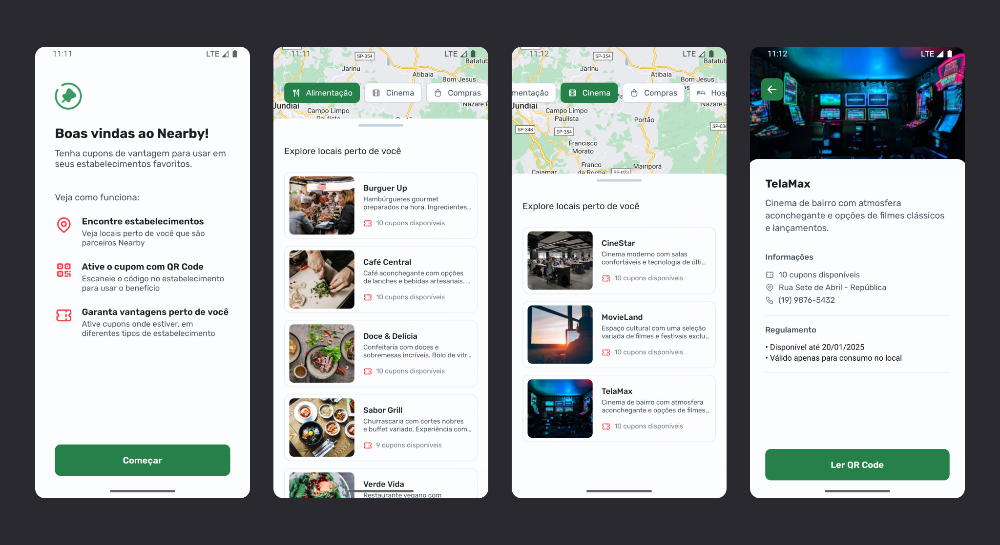

#  Nearby: Clube de Benefícios



Aplicativo móvel de clube de benefícios, oferecendo cupons exclusivos para serem utilizados em estabelecimentos próximos.

🚀 Projeto desenvolvido durante o evento **NLW Pocket Mobile**, promovido pela **Rocketseat**.

## Tecnologias

- React Native (Expo)
- TypeScript
- Axios
- Node.js (Express)
- Prisma
- SQLite

## Configuração

Clone este repositório:

```
git clone <URL do repositório>
```

📱 **Mobile**

Acesse o diretório e instale todas as dependências:

```
cd <nome do diretório>
npm install
```

Inicie o servidor de desenvolvimento do Expo Go:

```
npx expo start
```

🛠️ **_Back-end_**

Acesse o diretório e instale todas as dependências:

```
cd api
npm install
```

Inicie o servidor local:

```
npm start
```

Gerencie o banco de dados:

```
npx prisma studio
```
